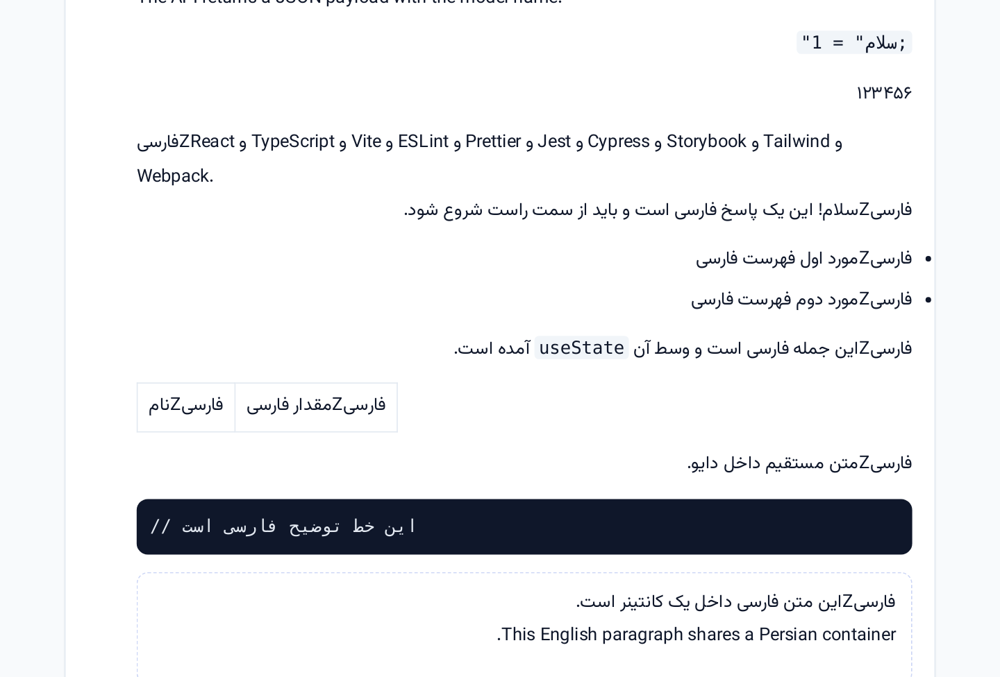

# ParsiChin

A Chrome extension (Manifest V3) that makes **mixed Persian/English answers readable** on AI chat pages —
ChatGPT, Claude, Gemini, Perplexity, DeepSeek, Microsoft Copilot, Le Chat (Mistral) and Hugging Face Chat.

> **v0.2.0 — RTL engine rewrite.** The previous version delegated direction to `dir="auto"` and
> `unicode-bidi: plaintext`, which silently rendered Persian paragraphs left-to-right and flipped the
> layout line by line. The full audit (root causes + measurements) is in
> **[docs/rtl-audit.md](docs/rtl-audit.md)**. Same 95-probe fixture in headless Chromium:
> **22 failing before → 0 failing after.**

## The problem

An LLM answer is usually one paragraph long and mixes Persian prose with English tokens
(`Prompt`, `Model`, `useState`, `npm install`). Browsers get the direction wrong for such text:

* the paragraph is laid out **left-to-right** whenever the answer happens to *start* with a Latin word,
* `unicode-bidi: plaintext` makes **each line choose its own direction** (Latin line left, Persian line right),
* the wrong direction leaks from a flipped container into English paragraphs, moving punctuation to the wrong end,
* Persian list bullets stay on the left while the text jumps right.

The result is the familiar zig-zag, uneven margins and words that appear to be missing.

## What ParsiChin does

* **Content-based direction** — Persian letters are counted against Latin letters *and* real Persian words
  are detected, so `API این سرویس ...` is Persian (RTL) even though it starts with a Latin token.
  Direction is decided **once per block**, never per line, so streaming answers do not flip around.
* **Explicit, cascade-proof styling** — the decision is written both as `dir="rtl|ltr"` and as the
  `.pc-rtl` / `.pc-ltr` classes that carry `!important` rules, which survive chat UIs that hard-code
  `direction: ltr` (and even `direction: ltr !important`) on message bodies.
* **Containment** — English-only paragraphs inside a flipped container (e.g. DeepSeek's `.ds-markdown`)
  are pinned back to LTR, so their punctuation and alignment stay correct.
* **Persian typography** — bundled **Vazirmatn** (offline, no network request), line height 1.9,
  right alignment, adjustable font size and weight.
* **Lists done properly** — the list container is flipped with its items, so bullets sit next to the text.
* **Safe by default** — code blocks, forms and chat inputs are never touched; numbers-only and code-only
  blocks are left alone; disabling the extension restores the page exactly (including a `dir` attribute
  the site had set itself).
* **Live updates** — a `MutationObserver` decorates answers while they stream in.
* **Two modes** — `auto` (only blocks that contain Persian) or `always` (every block of the conversation).

## Install (development)

1. Clone the repository.
2. `bash scripts/check.sh` — validates JSON, JS syntax and required files.
3. Open `chrome://extensions`, enable **Developer mode**.
4. **Load unpacked** → select the repository root.
5. Open ChatGPT/Claude/Gemini — Persian text is now RTL and readable.

Package for the Web Store: `npm run build` → `dist/parsi-chin-v0.2.0.zip`.

## Live RTL lab (no extension install needed)

```bash
npm run demo          # → http://localhost:8080/
```

The lab loads the **real** content script and stylesheet into a mock AI chat page, measures every probe in
*your* browser (base direction, alignment, list markers, direction leaks, per-line flip-flop) and prints a
PASS/FAIL table. Switch between:

* **Before fix (v0.1.0 snapshot)** and **After fix (v0.2.0)** — the snapshot lives in `demo/legacy/`,
* a **friendly** and a **hostile** site stylesheet (`direction: ltr !important`),
* the **DeepSeek** container rule and the plain ChatGPT rule.



## Project layout

```
ParsiChin/
├── manifest.json              # MV3 config, supported hosts
├── _locales/                  # extension strings (fa / en)
├── src/
│   ├── shared/                # defaults, settings (chrome.storage), i18n
│   ├── background/            # service worker: settings, badge, dynamic scripts
│   ├── content/
│   │   ├── bidi.js            # Persian detection, classification, direction
│   │   ├── rules.js           # per-site rules (root selector, block selectors)
│   │   └── entry.js           # DOM scan, MutationObserver, apply / cleanup
│   ├── popup/                 # toolbar popup (on/off + site status)
│   └── options/               # full options page with a live preview
├── styles/                    # extension CSS + bundled Vazirmatn (OFL)
├── demo/                      # RTL lab (English) + v0.1.0 snapshot in legacy/
├── tools/
│   ├── rtl-audit.js           # headless-Chromium audit of the real sources
│   └── serve.js               # static server for the lab
├── tests/                     # jsdom smoke + UI sanity tests
├── docs/
│   ├── rtl-audit.md           # root-cause audit and measurements
│   ├── rtl-audit-before.json  # machine-readable report (v0.1.0)
│   └── rtl-audit-after.json   # machine-readable report (v0.2.0)
└── scripts/                   # check.sh / build.sh / ci-check.sh
```

## Supported sites

ChatGPT (`chatgpt.com`, `chat.openai.com`, `openai.com`), Claude, Gemini, Perplexity, DeepSeek,
Microsoft Copilot, Le Chat (Mistral), Hugging Face Chat.

Adding a site: add the URL pattern to `content_scripts.matches` in `manifest.json` and an entry with a
stable `root` selector to `src/content/rules.js`; then add the domain under *custom sites* in the options.

## Settings

* **Apply mode** — automatic (Persian blocks only) or always (every block of the conversation)
* **Font** — bundled Vazirmatn (offline) or the site's own font
* **Font size / line height / weight**
* **Punctuation normalization** (experimental): `سلام, دنیا` → `سلام، دنیا`
* **Code stays LTR**, **disable a site**, **custom sites**, **all sites** (optional host permission)
* **Backup** — JSON export/import and factory reset

## Development

```bash
npm install            # only for the tests (jsdom)
npm test               # content-script tests + regression tests for every RTL defect
npm run check          # JSON / JS syntax / required files
npm run build          # dist/parsi-chin-v0.2.0.zip
npm run demo           # RTL lab on http://localhost:8080/
npm run audit:rtl      # headless-Chromium audit (needs playwright-core + Chromium)
```

Design rules: no runtime dependencies, no network requests, no framework; classic scripts on a global
`window.ParsiChin` namespace. See [CONTRIBUTING.md](CONTRIBUTING.md).

## Known limitations

* **Table columns** — cells are flipped individually; a fully RTL table would require reversing column
  order, which breaks layout tables.
* **Shadow DOM / iframes** — not scanned (`all_frames: false`; see ROADMAP phase 2).
* **Persian comments inside code blocks** use the page's monospace font, which on some systems renders
  Arabic script without joining (the bundled Vazirmatn is used as a last-resort fallback).
* **Per-site roots** — a site that renames its `main`-like container needs a new rule entry.

## Roadmap and license

Planned work and suggested commit-sized phases: [ROADMAP.md](ROADMAP.md).
Changes in this release: [CHANGELOG.md](CHANGELOG.md) · suggested commit log: [COMMITS.txt](COMMITS.txt).

Code: MIT · Vazirmatn font: SIL Open Font License (`styles/fonts/LICENSE-OFL.txt`).
